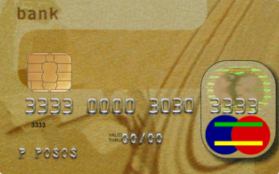
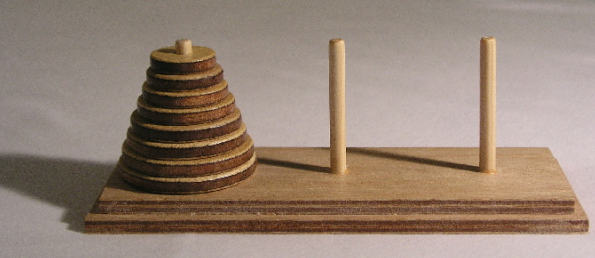
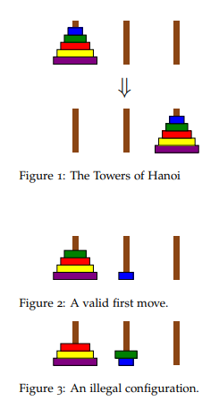

# CIS 194: Homework 1

> Due Monday, January 14  

When solving the homework, strive to create not just code that works, but code that is stylish and concise. See the style guide on the website for some general guidelines. Try to write small functions which perform just a single task, and then combine those smaller pieces to create more complex functions. Don’t repeat yourself: write one function for each logical task, and reuse functions as necessary.  
숙제를 풀 때, 작동하는 코드뿐만 아니라 스타일리시하고 간결한 코드를 작성하도록 노력하세요. 일반적인 지침은 웹사이트의 스타일 가이드를 참조하세요. 단일 작업만 수행하는 작은 함수를 작성한 다음, 이러한 작은 조각들을 결합하여 더 복잡한 함수를 만드세요. 코드를 반복하지 마세요: 각 논리적 작업마다 하나의 함수를 작성하고 필요에 따라 함수를 재사용하세요.

Be sure to write functions with exactly the specified name and type signature for each exercise (to help us test your code). You may create additional helper functions with whatever names and type signatures you wish.  
각 연습 문제마다 정확히 지정된 이름과 타입 시그니처를 가진 함수를 작성해야 합니다(코드 테스트에 도움이 됩니다). 원하는 이름과 타입 시그니처를 가진 추가적인 도우미 함수를 생성할 수 있습니다.

## Validating Credit Card Numbers

## 신용 카드 번호 검증

Have you ever wondered how websites validate your credit card number when you shop online? They don’t check a massive database of numbers, and they don’t use magic. In fact, most credit providers rely on a checksum formula for distinguishing valid numbers from random collections of digits (or typing mistakes).  
온라인 쇼핑 시 웹사이트가 어떻게 신용 카드 번호를 검증하는지 궁금해 본 적이 있나요? 그들은 방대한 데이터베이스를 확인하지도 않고, 마법을 사용하지도 않습니다. 실제로 대부분의 신용 카드 제공업체는 유효한 번호를 임의의 숫자 모음(혹은 잘못된 입력)과 구별하기 위해 체크섬 공식을 사용합니다.



In this section, you will implement the validation algorithm for credit cards. It follows these steps:  
이 섹션에서는 신용 카드 검증 알고리즘을 구현합니다. 알고리즘은 다음 단계를 따릅니다:
- Double the value of every second digit beginning from the right.
That is, the last digit is unchanged; the second-to-last digit is doubled; the third-to-last digit is unchanged; and so on. For example, [1,3,8,6] becomes [2,3,16,6].  
오른쪽부터 시작하여 두 번째 숫자마다 값을 두 배로 만듭니다.
즉, 마지막 숫자는 변경되지 않고, 그 전 숫자는 두 배로, 그 전 숫자는 변경되지 않으며, 이런 식으로 진행됩니다. 예를 들어, [1,3,8,6]은 [2,3,16,6]이 됩니다.
- Add the digits of the doubled values and the undoubled digits from the original number. For example, [2,3,16,6] becomes 2+3+1+6+6 = 18  
두 배로 만든 값들의 각 자리수와 원래 숫자의 두 배로 만들지 않은 숫자들을 모두 더합니다. 예를 들어, [2,3,16,6]은 2+3+1+6+6 = 18이 됩니다.
- Calculate the remainder when the sum is divided by 10. For the above example, the remainder would be 8.  
합을 10으로 나눈 나머지를 계산합니다. 위 예에서는 나머지가 8입니다.

If the result equals 0, then the number is valid.  
결과가 0이면 그 숫자는 유효한 것입니다.

### Exercise 1 

We need to first find the digits of a number. Define the functions  
먼저 숫자의 자릿수를 찾아야 합니다. 다음 함수를 정의하세요.

```haskell
toDigits :: Integer -> [Integer]
toDigitsRev :: Integer -> [Integer]
```

toDigits should convert positive Integers to a list of digits. (For 0 or negative inputs, toDigits should return the empty list.) toDigitsRev should do the same, but with the digits reversed.  
toDigits는 양의 정수를 자릿수의 리스트로 변환해야 합니다. (0 또는 음수 입력의 경우, toDigits는 빈 리스트를 반환해야 합니다.) toDigitsRev는 동일하지만, 자릿수를 역순으로 반환해야 합니다.

```haskell
-- Example: 
toDigits 1234 == [1,2,3,4]

-- Example: 
toDigitsRev 1234 == [4,3,2,1]

-- Example: 
toDigits 0 == []

-- Example: 
toDigits (-17) == []
```

### Exercise 2

Once we have the digits in the proper order, we need to double every other one. Define a function  
자릿수를 올바른 순서로 얻은 후, 그 중 하나씩 두 배로 만들어야 합니다. 다음 함수를 정의하세요.

```haskell
doubleEveryOther :: [Integer] -> [Integer]
```

Remember that doubleEveryOther should double every other number *beginning from the right*, that is, the second-to-last, fourth-to-last, . . . numbers are doubled.  
doubleEveryOther는 *오른쪽부터 시작하여* 매 두 번째 숫자를 두 배로 만들어야 합니다. 즉, 두 번째 마지막, 네 번째 마지막 등의 숫자가 두 배로 됩니다.

```haskell
-- Example: 
doubleEveryOther [8,7,6,5] == [16,7,12,5]

-- Example: 
doubleEveryOther [1,2,3] == [1,4,3]
```

### Exercise 3 

The output of doubleEveryOther has a mix of one-digit and two-digit numbers. Define the function  
doubleEveryOther의 출력에는 한 자리수와 두 자리수의 숫자가 섞여 있습니다. 다음 함수를 정의하세요.

```haskell
sumDigits :: [Integer] -> Integer
```

to calculate the sum of all digits.  
모든 자릿수의 합을 계산하기 위해.

```haskell
-- Example: 
sumDigits [16,7,12,5] = 1 + 6 + 7 + 1 + 2 + 5 = 22
```

### Exercise 4 

Define the function  
함수를 정의하세요.

```haskell
validate :: Integer -> Bool
```

that indicates whether an Integer could be a valid credit card number. This will use all functions defined in the previous exercises.  
정수가 유효한 신용 카드 번호인지 여부를 나타내는 함수입니다. 이전 연습 문제에서 정의한 모든 함수를 사용합니다.

```haskell
-- Example: 
validate 4012888888881881 = True

-- Example: 
validate 4012888888881882 = False
```

## The Towers of Hanoi





### Exercise 5 

*The Towers of Hanoi* is a classic puzzle with a solution that can be described recursively. Disks of different sizes are stacked on three pegs; the goal is to get from a starting configuration with all disks stacked on the first peg to an ending configuration with all disks stacked on the last peg, as shown in Figure 1.  
*하노이의 탑*은 재귀적으로 설명할 수 있는 해법을 가진 고전적인 퍼즐입니다. 크기가 다른 디스크들이 세 개의 말뚝에 쌓여 있으며, 목표는 모든 디스크가 첫 번째 말뚝에 쌓여 있는 시작 구성에서 모든 디스크가 마지막 말뚝에 쌓여 있는 종료 구성으로 이동하는 것입니다 (그림 1 참조).

The only rules are  
유일한 규칙은
- you may only move one disk at a time, and  
한 번에 하나의 디스크만 이동할 수 있으며,
- a larger disk may never be stacked on top of a smaller one.  
더 큰 디스크를 더 작은 디스크 위에 쌓을 수 없습니다.

For example, as the first move all you can do is move the topmost, smallest disk onto a different peg, since only one disk may be moved at a time.  
예를 들어, 첫 번째 이동으로 할 수 있는 것은 가장 위에 있는 가장 작은 디스크를 다른 말뚝으로 옮기는 것뿐입니다. 왜냐하면 한 번에 하나의 디스크만 이동할 수 있기 때문입니다.

From this point, it is *illegal* to move to the configuration shown in Figure 3, because you are not allowed to put the green disk on top of the smaller blue one.  
이 시점부터는 그림 3에 표시된 구성으로 이동하는 것은 *불법*입니다. 왜냐하면 더 작은 파란색 디스크 위에 녹색 디스크를 올릴 수 없기 때문입니다.

To move `n` discs (stacked in increasing size) from peg `a` to peg `b` using peg `c` as temporary storage,  
`n`개의 디스크(크기가 증가하는 순서대로 쌓인)를 `a` 말뚝에서 `b` 말뚝으로 옮기기 위해 `c` 말뚝을 임시 저장소로 사용할 때,
1. move `n` − 1 discs from `a` to `c` using `b` as temporary storage  
move `n` − 1개의 디스크를 `a`에서 `c`로 `b`를 임시 저장소로 사용하여 옮깁니다.
2. move the top disc from `a` to `b`  
`a`에서 `b`로 가장 위의 디스크를 옮깁니다.
3. move `n` − 1 discs from `c` to `b` using `a` as temporary storage.  
move `n` − 1개의 디스크를 `c`에서 `b`로 `a`를 임시 저장소로 사용하여 옮깁니다.

For this exercise, define a function hanoi with the following type:  
이 연습 문제를 위해, 다음과 같은 타입을 가진 `hanoi` 함수를 정의하세요:

```haskell
type Peg = String
type Move = (Peg, Peg)
hanoi :: Integer -> Peg -> Peg -> Peg -> [Move]
```

Given the number of discs and names for the three pegs, hanoi should return a list of moves to be performed to move the stack of discs from the first peg to the second.  
디스크의 개수와 세 개의 말뚝 이름이 주어지면, `hanoi`는 첫 번째 말뚝에서 두 번째 말뚝으로 디스크 더미를 옮기기 위해 수행해야 할 이동 목록을 반환해야 합니다.

Note that a type declaration, like type Peg = String above, makes a *type synonym*. In this case Peg is declared as a synonym for String, and the two names Peg and String can now be used interchangeably. Giving more descriptive names to types in this way can be used to give shorter names to complicated types, or (as here) simply to help with documentation.  
타입 선언, 예를 들어 위의 `type Peg = String`은 *타입 동의어*를 만듭니다. 이 경우 Peg는 String의 동의어로 선언되었으며, Peg와 String 두 이름을 상호 교환하여 사용할 수 있습니다. 이러한 방식으로 타입에 더 설명적인 이름을 부여하면 복잡한 타입에 더 짧은 이름을 줄 수 있거나(여기서는) 단순히 문서화를 돕는 데 사용할 수 있습니다.

```haskell
-- Example: 
hanoi 2 "a" "b" "c" == [("a","c"), ("a","b"), ("c","b")]
```

### Exercise 6 (Optional) 

What if there are four pegs instead of three? That is, the goal is still to move a stack of discs from the first peg to the last peg, without ever placing a larger disc on top of a smaller one, but now there are two extra pegs that can be used as “temporary” storage instead of only one. Write a function similar to hanoi which solves this problem in as few moves as possible.  
세 개가 아닌 네 개의 말뚝이 있다면 어떻게 될까요? 즉, 목표는 여전히 더 큰 디스크를 더 작은 디스크 위에 놓지 않고 첫 번째 말뚝에서 마지막 말뚝으로 디스크 더미를 옮기는 것이지만, 이제 임시 저장소로 사용할 수 있는 말뚝이 하나가 아닌 두 개 추가로 있습니다. 가능한 적은 이동으로 이 문제를 해결하는 `hanoi`와 유사한 함수를 작성하세요.

It should be possible to do it in far fewer moves than with three pegs. For example, with three pegs it takes 2^15 − 1 = 32767 moves to transfer 15 discs. With four pegs it can be done in 129 moves. (See Exercise 1.17 in Graham, Knuth, and Patashnik, *Concrete Mathematics*, second ed., Addison-Wesley, 1994.)  
세 개의 말뚝을 사용할 때보다 훨씬 적은 이동으로 수행할 수 있어야 합니다. 예를 들어, 세 개의 말뚝을 사용하면 15개의 디스크를 옮기는 데 2^15 − 1 = 32767번의 이동이 필요합니다. 네 개의 말뚝을 사용하면 129번의 이동으로 수행할 수 있습니다. (참조: Graham, Knuth, and Patashnik의 *Concrete Mathematics*, 두 번째 판, Addison-Wesley, 1994년, 연습 문제 1.17)

---
